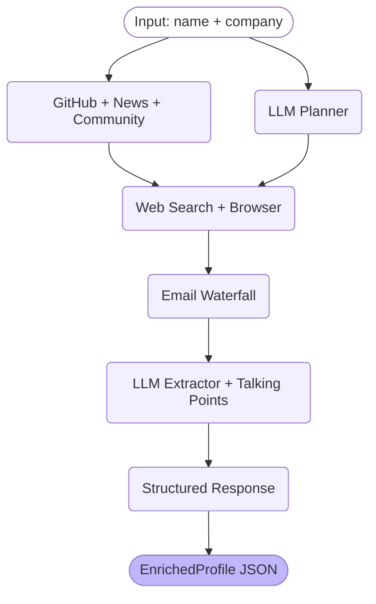

# Lead Enrichment Agent

AI-powered lead research that turns a name + company into a structured profile with talking points in under 45 seconds.

## How It Works

Give it a person's name and company. It searches 7 public sources concurrently, extracts a structured JSON profile, and generates use-case-specific conversation starters — all through a single API call.

```
POST /enrich {"name": "Guillermo Rauch", "company": "Vercel", "use_case": "sales"}

-> Structured profile, confidence scores, 7 talking points, source-attributed findings
```

## Architecture

Two LLM calls per request. Everything in between is deterministic concurrent execution.



**Phase A** (concurrent): LLM planner runs in parallel with GitHub, news, and community tools
**Phase B** (planner-dependent): Web search queries + browser scraping from planner output
**Phase B.5**: 4-layer email waterfall (GitHub → regex → SMTP → Hunter.io)
**Phase C** (concurrent): Profile extraction + talking points generation

## Features

- **7 data sources**: GitHub API, Serper web search, Serper news, HN/Reddit community, Playwright browser, SMTP verification, Hunter.io email
- **4-layer email waterfall**: Tries 3 free methods before burning Hunter.io credits (25/month)
- **Semantic cache**: Qdrant vector search with OpenAI embeddings — repeat lookups in ~2s
- **LangGraph orchestration**: StateGraph with fan-out/fan-in for parallel execution
- **3 use cases**: Sales, recruiting, and job search — each generates tailored talking points
- **Eval framework**: 10 ground truth cases with automated scoring (exact match, contains, list checks)
- **Retry with backoff**: Exponential retry (1s/2s/4s + jitter) on all API calls — only 5xx and timeouts, never 4xx
- **Langfuse observability**: Per-node spans, LLM generation logging with token counts (graceful no-op when disabled)

## Benchmarks

Real numbers from the eval suite and benchmark runner.

| Metric | Value |
|--------|-------|
| Eval accuracy | **100%** on 10 ground truth cases |
| Avg latency (cold) | **39s** per enrichment |
| Semantic cache hit | **~2s** (21x faster) |
| Phase C (LLM extraction) | **22-29s** (bottleneck) |
| Phase A (tools) | **2-6s** |
| Success rate | **10/10** cases, 0 crashes |
| Cost per request | **~$0.03** (2 LLM calls: Sonnet planner + Haiku extractor) |

## Setup

```bash
git clone <repo-url> && cd lead-enrichment-agent
python -m venv venv && source venv/bin/activate
pip install -r requirements.txt
playwright install chromium

cp .env.example .env
# Edit .env with your API keys
```

### Required API Keys

| Variable | Purpose | Free Tier |
|----------|---------|-----------|
| `ANTHROPIC_API_KEY` | Claude for planner + extractor | Pay-as-you-go |
| `SERPER_API_KEY` | Google search + news | 2,500 free queries |
| `GITHUB_TOKEN` | GitHub API (30 req/min vs 10) | Free |

### Optional

| Variable | Purpose |
|----------|---------|
| `HUNTER_API_KEY` | Email finder (Layer 4 fallback, 25/month free) |
| `SCRAPERAPI_KEY` | Proxy for browser scraping |
| `QDRANT_URL` + `QDRANT_API_KEY` + `OPENAI_API_KEY` | Semantic cache |
| `LANGFUSE_PUBLIC_KEY` + `LANGFUSE_SECRET_KEY` | Observability dashboard |

## Usage

### CLI
```bash
# Sales outreach
python test_agent.py "Guillermo Rauch" "Vercel" "" "sales"

# Recruiting
python test_agent.py "Mitchell Hashimoto" "Ghostty" "" "recruiting"

# Job search
python test_agent.py "Kelsey Hightower" "Google" "" "job_search"
```

### API Server
```bash
uvicorn main:app --reload

curl -X POST http://localhost:8000/enrich \
  -H "Content-Type: application/json" \
  -d '{"name": "Satya Nadella", "company": "Microsoft", "use_case": "sales"}'
```

### Eval Suite
```bash
# Run all 10 ground truth cases
python -m evals.run_eval --no-judge

# Single case
python -m evals.run_eval --case dhh

# Benchmark (3 runs, cold + warm)
python -m benchmarks.benchmark --runs 3
```

## Tech Stack

| Layer | Technology |
|-------|------------|
| Orchestration | LangGraph StateGraph with fan-out/fan-in |
| LLM | Claude Sonnet (planner, talking points) + Haiku (extractor) |
| API framework | FastAPI + uvicorn |
| Browser | Playwright (headless Chromium) |
| Search | Serper.dev (Google Search + News API) |
| Email | 4-layer waterfall: GitHub → regex → SMTP → Hunter.io |
| Caching | In-memory TTL (tools) + Qdrant semantic (responses) |
| Observability | Langfuse (traces, spans, LLM generations) |
| Retry | Exponential backoff with jitter on all external calls |
| Validation | Pydantic v2 schemas with confidence scoring |

## Project Structure

```
├── main.py                     # FastAPI entry point
├── config.py                   # Environment-based configuration
├── agent/
│   ├── orchestrator.py         # Pipeline entry point + semantic cache
│   ├── graph.py                # LangGraph StateGraph definition
│   ├── graph_state.py          # TypedDict state with reducers
│   ├── planner.py              # LLM tool selection + query generation
│   ├── extractor.py            # LLM extraction + talking points + narrative
│   ├── schemas.py              # Pydantic models (EnrichedProfile, ToolResult, etc.)
│   ├── tool_protocol.py        # Tool Protocol + registry
│   ├── cache.py                # In-memory TTL cache
│   ├── semantic_cache.py       # Qdrant vector cache
│   ├── utils.py                # Retry decorator with exponential backoff
│   └── observe.py              # Langfuse instrumentation (no-op when disabled)
├── tools/
│   ├── github_tool.py          # GitHub REST API (profile, repos, activity)
│   ├── serper_tool.py          # Serper Google search
│   ├── news_tool.py            # Serper Google News
│   ├── community_tool.py       # HN Algolia + Reddit via Serper
│   ├── playwright_tool.py      # Headless browser with DNS pre-check
│   ├── email_pipeline.py       # 4-layer email waterfall
│   ├── hunter_tool.py          # Hunter.io (called by email pipeline)
│   └── proxy.py                # Proxy manager for browser
├── evals/
│   ├── ground_truth.json       # 10 manually verified test cases
│   ├── evaluator.py            # Scoring functions
│   └── run_eval.py             # CLI runner with --no-judge flag
└── benchmarks/
    └── benchmark.py            # Latency benchmarking with phase timing
```
